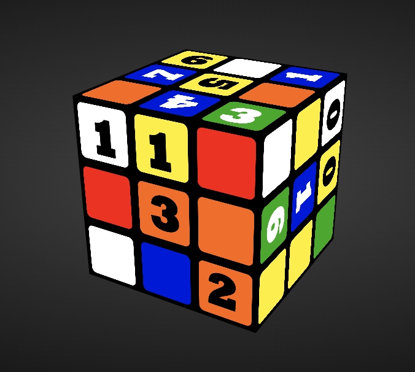
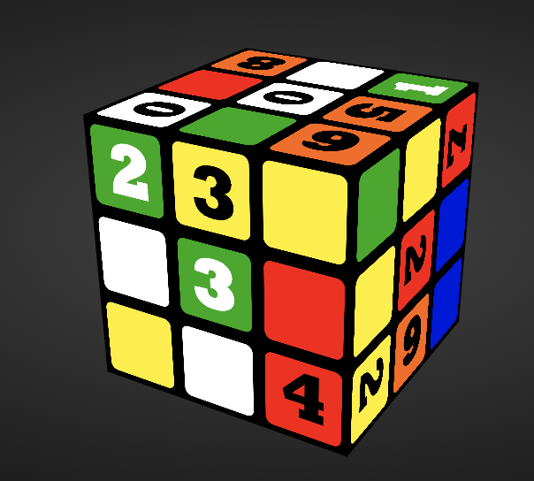

Rubik's Clock
==============================================================================

Rubiks'c clock presents a webpage of a Rubik's cube that automatically updates every minute showing the current time of day.

This is the javascript engine behind the great Instructable `Rubik's Clock` documented here: https://www.instructables.com/Rubiks-Clock/

The implementation is based on the javascript/HTML code of Cuber found at https://github.com/stewdio/Cuber-DEMO. Cuber is a Rubik’s Cube simulator.  Rubik's Clock adds the concept of a photo cube to
Cuber.  The 6 PNG images are carefully crafted with a set of numbers on all sides.  It implements a solver that moves the pieces every minute so the numbers of the current hour and minute show on the front of the cube.

## Running Rubik's Clock

### From the desktop
There are two versions.  A 12-hour clock and a 24-hour clock.  The 12-hour clock rolls over at noon so the next hour is 1:00 (pm).  The 24-hour clock keeps counting up after noon so the next hour is 13:00.

From your Chrome browser (or Safari, or Edge, or a multitude of others) enter your choice:

- `index.html` for a 12-hour "am/pm" Rubick's clock (default)
- `index.html#clock12` for a 12-hour "am/pm" Rubick's clock

- `index.html#clock24` for a 24-hour "European" or "Military Time" clock

#### 12-hour

#### 24-hour

## Buttons and Widgets

### Brightness
The entire left side of the window is a big hidden button that controls the brightness.
There are four brightness settings.  Keep pressing the left side to make the display dimmer.
Eventually it wil go to full brightness again.

### Options
Press the Options button on the upper-right to show the cube in different configurations:
- Clock Style
  - 12 hour shows the clock in 12-hour mode (am/pm)
  - 24 hour switches the clock to 24-hour mode
- Size gives you a selection of different sizes from tiny to giant
- Extras
  - Cube control allows you to rotate the cube with your mouse
  - Auto rotate will set the cube in motion
  - Show twist notation will flash the move letter as the cube transitions to a new time of day
  - Cube face labels shows the name of each face.
    - Up
    - Left
    - Front (is the face with the current time of day)
    - Right
    - Back
    - Down

https://github.com/stewdio/Cuber-DEMO
https://github.com/mhirst1960/rubiks-clock/tree/main
